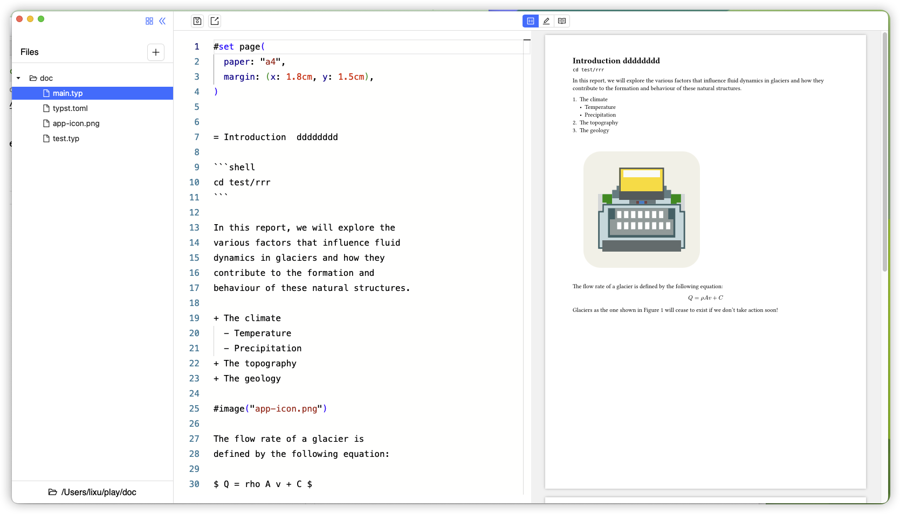

# [WIP] typster 

A W.I.P desktop application for a new markup-based typesetting language, [typst](https://github.com/typst/typst).
Typster is built using [Tauri](https://tauri.app/).


# features
- [ ]
- [ ] 

typst = { version = "0.11.0" }
主要的依赖，包含文档，页面 等

typst-ide = { version = "0.11.0" }
编辑器做自动补全语法用的

typst-pdf = { version = "0.11.0" }
导出pdf 

typst-render = { version = "0.11.0" }
实时渲染用的，编辑器浏览的实际是一个页文档渲染出的一张png 图片

typst-syntax = { version = "0.11.0" }
typest语法依赖，但是项目中主要是用来解析外部的package 和文件路径

## screenshot





# Download


[download link](https://github.com/wflixu/typster/releases)

### MacOS


```
 xattr -c /Applications/typster.app
```
### rebuild app icon

```
pnpm tauri icon
```


## Other similar projects:

- https://github.com/Cubxity/typstudio
- https://github.com/Enter-tainer/typst-preview

## Related projects
- https://github.com/Enter-tainer/typstyle
- https://github.com/nvarner/typst-lsp
