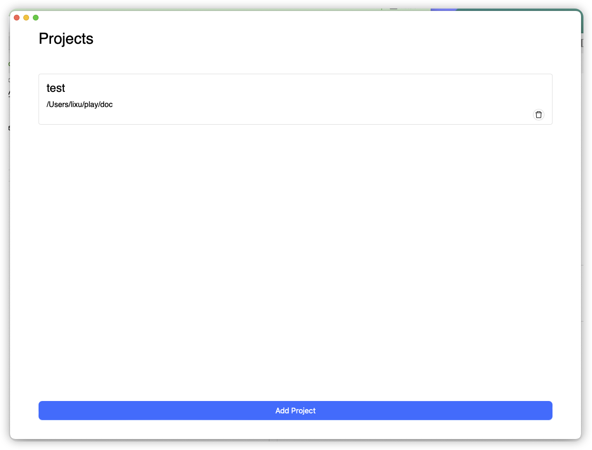
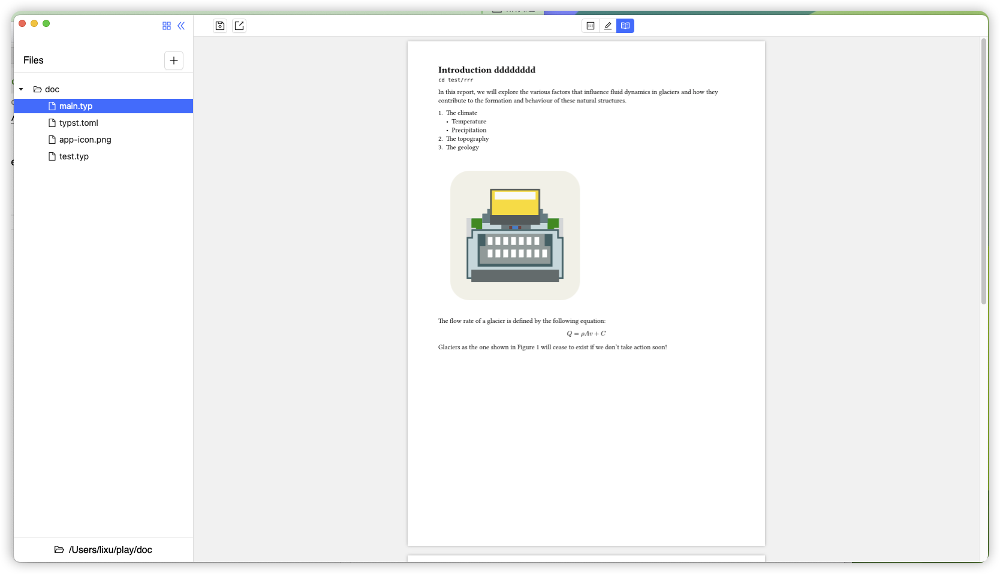

# [WIP] typster 

A W.I.P desktop application for a new markup-based typesetting language, [typst](https://github.com/typst/typst).
Typster is built using [Tauri](https://tauri.app/).


# screenshot








# Download


[download link](https://github.com/wflixu/typster/releases)

### MacOS


```
 xattr -c /Applications/appname.app
```