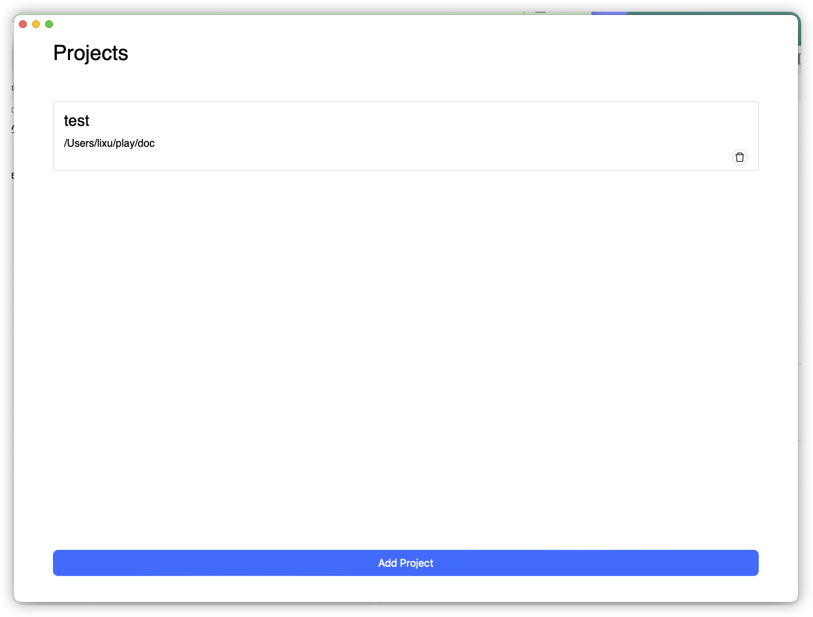
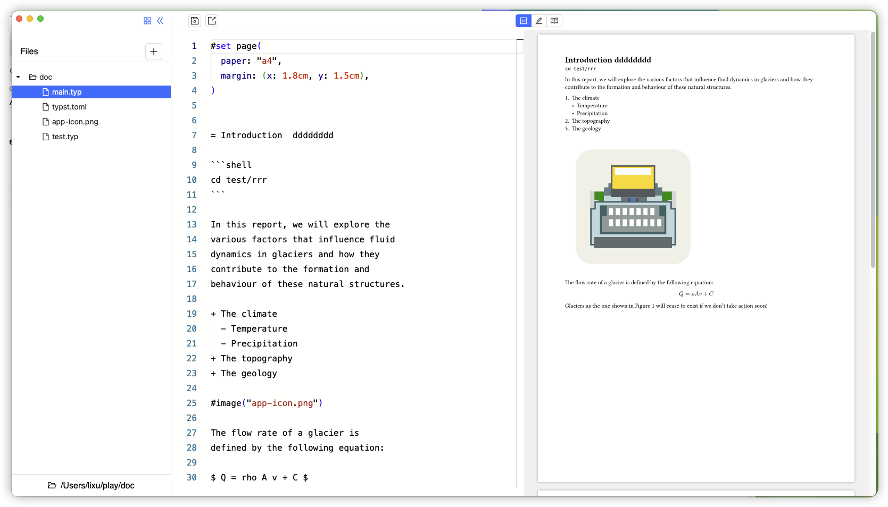
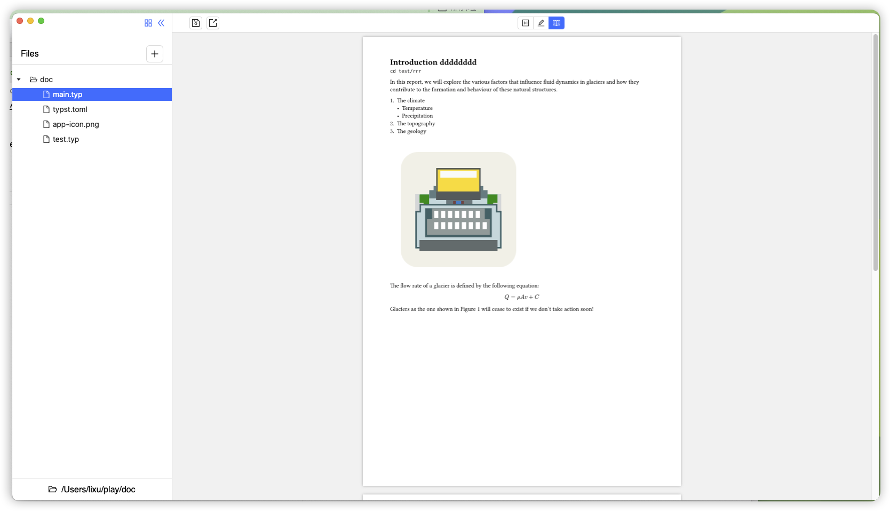

# Typster

> 🚀 **现代化的 Typst 可视化编辑器** - 提供 Typora 风格的所见即所得编辑体验

Typster 是一款基于 Tauri 2.0 + Vue 3 + TypeScript 构建的现代化桌面应用，专注于为 Typst 标记语言提供直观、高效的编辑体验。

## 🎯 项目概述

**核心目标**: 通过"混合编辑模式"，将 Typst 的强大功能与 简单的编辑体验相结合

**核心对标**: Typora (Markdown 编辑器) + Typst (现代化排版系统)

**当前状态**: 🔄 开发中 - Phase 1 基础架构完成，正在进行 Phase 2 数学公式渲染系统

---

## ✨ 核心特性

### 🎨 **Typora 风格界面**
- 所见即所得 (WYSIWYG) 编辑体验
- 简洁现代的 macOS 原生界面
- 实时预览和无缝编辑切换
- 自适应编辑器布局

### 🔥 **混合编辑模式**
- **点击编辑**: 点击已渲染内容切换到源码编辑
- **模糊渲染**: 失去焦点时自动渲染为预览
- **智能切换**: 根据内容类型自动选择最适合的编辑模式

### 🧮 **数学公式系统**
- **LaTeX 语法支持**: 完整的 LaTeX 数学公式语法
- **实时渲染**: KaTeX 高性能数学公式渲染
- **点击编辑**: 点击公式即可编辑 LaTeX 源码
- **专业排版**: 与 Typst 数学引擎完美兼容

### 📝 **完整 Markdown 支持**
- 标准 Markdown 和 GFM 语法
- 表格、列表、代码块可视化编辑
- 语法高亮和智能补全
- 大型文档性能优化

### ⚡ **高性能架构**
- **毫秒级响应**: 输入延迟 < 16ms
- **增量渲染**: 只重算修改的部分
- **内存优化**: 支持大型文档编辑
- **跨平台**: 基于 Tauri 2.0 的原生性能

---

## 🛠️ 技术栈

### 前端技术
- **Vue 3** - 响应式框架
- **TypeScript** - 类型安全
- **Tiptap** - 现代化富文本编辑器 (基于 ProseMirror)
- **PrimeVue** - UI 组件库
- **KaTeX** - 数学公式渲染

### 后端技术
- **Rust** - 高性能后端语言
- **Tauri 2.0** - 跨平台应用框架
- **Typst 0.14.0** - 现代化排版系统

### 开发工具
- **Vite** - 快速构建工具
- **pnpm** - 包管理器
- **ESLint + Prettier** - 代码质量保证

---

## 📋 开发路线图

### 🎯 **第一阶段: 完美 Markdown 编辑器** (2-3周)
- ✅ **Phase 1**: 基础 WYSIWYG 编辑器
- 🔄 **Phase 2**: 数学公式渲染系统 (进行中)
- ⏳ **Phase 3**: Markdown 高级语法支持
- ⏳ **Phase 4**: 编辑器性能优化

### 🚀 **第二阶段: Typst 编辑器扩展** (3-4周)
- ⏳ **Phase 5**: Typst 集成和文档管理
- ⏳ **Phase 6**: Typst 语法和功能扩展
- ⏳ **Phase 7**: 统一编辑器体验

### 📅 **详细规划**
查看 [`DEVELOPMENT_PLAN.md`](./DEVELOPMENT_PLAN.md) 了解完整的开发计划和进度。

---

## 🎮 快速开始

### 环境要求
- **Node.js** >= 18.0.0
- **pnpm** >= 8.0.0
- **Rust** >= 1.70.0
- **macOS** (支持 Apple Silicon 和 Intel)

### 安装依赖
```bash
# 安装前端依赖
pnpm install

# 安装 Rust 依赖 (首次运行时自动)
pnpm tauri build
```

### 开发模式
```bash
# 启动完整开发环境 (前端 + Tauri)
pnpm start

# 或者分步启动
pnpm dev      # 启动前端开发服务器
pnpm tauri dev # 启动 Tauri 应用
```

### 构建应用
```bash
# 构建生产版本
pnpm pack

# 或者
pnpm tauri build
```

---

## 🖥️ 应用截图

### 主界面


### 编辑体验


### 预览功能


---

## 📁 项目结构

```
typster/
├── src/                          # 前端源码
│   ├── pages/typst/              # Typst 编辑器页面
│   │   └── TypstEditor.vue       # 主编辑器组件
│   ├── components/               # 可复用组件
│   │   ├── tiptap-editor/        # Tiptap 编辑器
│   │   ├── math-editor/          # 数学公式编辑器
│   │   └── ...                   # 其他组件
│   ├── store/                    # 状态管理 (Pinia)
│   └── shared/                   # 共享工具和类型
├── src-tauri/                    # Rust 后端
│   ├── src/                      # Rust 源码
│   │   ├── cmds/                 # IPC 命令处理
│   │   ├── typst_service/        # Typst 服务集成
│   │   └── config/               # 配置管理
│   └── Cargo.toml                # Rust 依赖
├── spec/                         # 产品文档
│   └── prd.md                    # 产品需求文档
├── public/                       # 静态资源
└── DEVELOPMENT_PLAN.md           # 开发计划
```

---

## 🤝 贡献指南

我们欢迎各种形式的贡献！

### 开发贡献
1. Fork 项目
2. 创建功能分支 (`git checkout -b feature/amazing-feature`)
3. 提交更改 (`git commit -m 'Add some amazing feature'`)
4. 推送到分支 (`git push origin feature/amazing-feature`)
5. 创建 Pull Request

### 问题报告
- 使用 [Issues](https://github.com/wflixu/typster/issues) 报告 Bug
- 提出功能建议
- 分享使用体验

### 开发规范
- 遵循 TypeScript 严格模式
- 使用 Prettier 格式化代码
- 为新功能添加测试
- 更新相关文档

---

## 📄 许可证

本项目采用 MIT 许可证 - 查看 [LICENSE](LICENSE) 文件了解详情。

---

## 🔗 相关链接

### 🌟 类似项目
- [typst-preview](https://github.com/Enter-tainer/typst-preview) - Typst 实时预览
- [Cubxity/typster](https://github.com/Cubxity/typster) - 另一个 Typst 编辑器

### 📚 生态系统
- [Typst](https://github.com/typst/typst) - 官方 Typst 编译器
- [typstyle](https://github.com/Enter-tainer/typstyle) - Typst 代码格式化
- [typst-lsp](https://github.com/nvarner/typst-lsp) - Typst 语言服务器

### 📖 文档
- [Typst 文档](https://typst.app/docs/)
- [Tauri 文档](https://tauri.app/v1/guides/)
- [Tiptap 文档](https://tiptap.dev/)

---

## 📞 联系我们

- **GitHub**: [wflixu/typster](https://github.com/wflixu/typster)
- **Issues**: [问题反馈](https://github.com/wflixu/typster/issues)
- **讨论**: [GitHub Discussions](https://github.com/wflixu/typster/discussions)

---

*最后更新: 2025-12-05*
*当前版本: v0.1.0 (开发中)*
