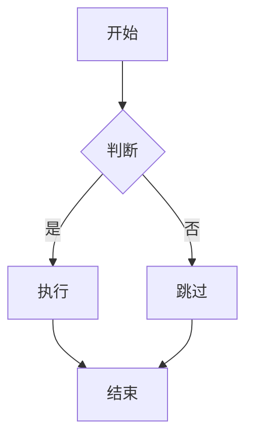

# Typster Markdown 编辑器开发计划

## 项目概述

**目标**：一比一复刻 Typora，打造极致的 Markdown WYSIWYG 编辑体验

**开发阶段**：
- **Phase 1 (v1.x)**: 完美 Markdown 编辑器

**核心原则**：
- 专注 Markdown 完美体验
- 优先实现 Typora 核心功能

---

## 开发总览

### 时间估算

| 阶段 | 内容 | 预估时间 | 优先级 |
|------|------|----------|--------|
| **Phase 0** | **编辑器基础功能**（编辑区布局，状态栏，侧边栏，设置页面，自动更新app等） | **5-7 天** | **P0** |
| Phase 1 | Markdown 语法完善 | 4-6 天 | **P0** |
| Phase 2 | **代码高亮和表格增强（Shiki）** | 3-4 天 | **P0** |
| Phase 3 | 高级功能和优化（Focus Mode、大纲、搜索、图片处理） | 5-6 天 | P1 |
| Phase 4 | 导出和主题系统 | 2-3 天 | P1 |
| Phase 5 | Mermaid 图表支持 | 3-4 天 | **P2** |

**总计**: 约 23-31 天（约 1-1.5 个月）

**注**：
- **Mermaid 图表**降级为 P2 优先级（锦上添花功能）

---

## Phase 0: 编辑器基础功能（新增，最优先）

### 目标
构建完整的 Markdown 编辑器基础框架，包括 UI 布局、设置系统、自动保存等核心功能。

### 当前状态分析

**已有功能**：
- ✅ 编辑区布局：`src/pages/home/Home.vue` (Grid 布局)
- ✅ 状态栏：`src/pages/home/StatusBar.vue` (文件路径、字数、光标位置)
- ✅ 侧边栏：`src/pages/home/Sidebar.vue` (文件树 + TOC 切换)
- ✅ 自动保存：60s 防抖，键盘快捷键，卸载保护

**缺失功能**：
- ❌ 设置页面：无设置 UI 或路由
- ❌ 自动更新：无 Tauri updater 配置
- ❌ 部分 Markdown 扩展：表格、代码高亮、脚注等

### 任务清单

#### 0.1 设置页面实现（1.5 天）

**创建文件**：
```bash
mkdir -p src/pages/settings
touch src/pages/settings/Settings.vue
touch src/pages/settings/EditorSettings.vue
touch src/pages/settings/AppearanceSettings.vue
touch src/pages/settings/AutosaveSettings.vue
touch src/store/settings-store.ts
touch src/composables/useSettings.ts
```

**Settings.vue 主容器**：
```vue
<template>
  <div class="settings-page">
    <div class="settings-header">
      <h1>设置</h1>
      <Button icon="pi pi-times" text @click="closeSettings" />
    </div>

    <div class="settings-content">
      <TabMenu :model="tabs" v-model:activeIndex="activeTab" />

      <div class="settings-panel">
        <EditorSettings v-if="activeTab === 0" />
        <AppearanceSettings v-if="activeTab === 1" />
        <AutosaveSettings v-if="activeTab === 2" />
      </div>
    </div>
  </div>
</template>

<script setup lang="ts">
import { ref } from 'vue'
import { useRouter } from 'vue-router'
import EditorSettings from './EditorSettings.vue'
import AppearanceSettings from './AppearanceSettings.vue'
import AutosaveSettings from './AutosaveSettings.vue'

const router = useRouter()
const activeTab = ref(0)

const tabs = [
  { label: '编辑器', icon: 'pi pi-file-edit' },
  { label: '外观', icon: 'pi pi-palette' },
  { label: '自动保存', icon: 'pi pi-save' },
]

const closeSettings = () => {
  router.back()
}
</script>
```

**设置状态管理**：
```typescript
// src/store/settings-store.ts
import { defineStore } from 'pinia'
import { ref, watch } from 'vue'

const SETTINGS_KEY = 'typster_settings_v1'

export interface EditorSettings {
  fontSize: number
  fontFamily: string
  lineHeight: number
  autoPairBrackets: boolean
}

export interface AppearanceSettings {
  themeMode: 'light' | 'dark' | 'auto'
  themePreset: string
  editorWidth: number
}

export interface AutosaveSettings {
  enabled: boolean
  interval: number
}

export const useSettingsStore = defineStore('settings', () => {
  const loadSettings = () => {
    const saved = localStorage.getItem(SETTINGS_KEY)
    return saved ? JSON.parse(saved) : null
  }

  const defaults = loadSettings()

  const editor = ref<EditorSettings>({
    fontSize: defaults?.fontSize || 16,
    fontFamily: defaults?.fontFamily || 'system-ui',
    lineHeight: defaults?.lineHeight || 1.6,
    autoPairBrackets: defaults?.autoPairBrackets ?? true,
  })

  const appearance = ref<AppearanceSettings>({
    themeMode: defaults?.themeMode || 'auto',
    themePreset: defaults?.themePreset || 'github-light',
    editorWidth: defaults?.editorWidth || 800,
  })

  const autosave = ref<AutosaveSettings>({
    enabled: defaults?.enabled ?? true,
    interval: defaults?.interval || 60,
  })

  // 持久化
  watch([editor, appearance, autosave], () => {
    localStorage.setItem(SETTINGS_KEY, JSON.stringify({
      editor: editor.value,
      appearance: appearance.value,
      autosave: autosave.value,
    }))
  }, { deep: true })

  return { editor, appearance, autosave }
})
```

**路由集成**：
```typescript
// src/router.ts
import Settings from './pages/settings/Settings.vue'

const routes = [
  // ... 现有路由
  {
    path: '/settings',
    name: 'Settings',
    component: Settings,
    meta: { title: '设置' }
  }
]
```

#### 0.2 自动更新机制（1 天）

**配置 Tauri Updater**：
```json
// src-tauri/tauri.conf.json
{
  "plugins": {
    "updater": {
      "active": true,
      "dialog": true,
      "endpoints": [
        "https://github.com/your-org/typster/releases/latest/download/latest.json"
      ],
      "pubkey": "your-public-key"
    }
  }
}
```

**Cargo.toml 依赖**：
```toml
# src-tauri/Cargo.toml
[dependencies]
tauri-plugin-updater = "2.0"
```

**更新检查 Composable**：
```typescript
// src/composables/useAutoUpdate.ts
import { check } from '@tauri-apps/plugin-updater'
import { ask } from '@tauri-apps/api/dialog'
import { relaunch } from '@tauri-apps/api/process'

export function useAutoUpdate() {
  const checkForUpdates = async (showNotification = false) => {
    try {
      const update = await check()

      if (update?.available) {
        const shouldUpdate = await ask(
          `发现新版本 ${update.version}，是否立即下载并安装？`,
          { title: '更新可用', kind: 'info' }
        )

        if (shouldUpdate) {
          await update.downloadAndInstall()
          await relaunch()
        }
      }
    } catch (error) {
      console.error('更新检查失败:', error)
    }
  }

  const initAutoUpdate = () => {
    setTimeout(() => checkForUpdates(false), 5000) // 启动 5 秒后检查
  }

  return { checkForUpdates, initAutoUpdate }
}
```

**集成到主应用**：
```typescript
// src/App.vue
<script setup lang="ts">
import { onMounted } from 'vue'
import { useAutoUpdate } from './composables/useAutoUpdate'

const { initAutoUpdate } = useAutoUpdate()

onMounted(() => {
  initAutoUpdate()
})
</script>
```

#### 0.3 编辑器增强（1.5 天）

**添加 Tiptap 扩展**：
```typescript
// src/pages/typst/TypstEditor.vue
import { Table, TableRow, TableCell, TableHeader } from '@tiptap/extension-table'
import TaskItem from '@tiptap/extension-task-item'
import TaskList from '@tiptap/extension-task-list'
import { CodeBlockLowlight } from '@tiptap/extension-code-block-lowlight'
import { createLowlight, common } from 'lowlight'

const lowlight = createLowlight(common)

const editor = useEditor({
  extensions: [
    StarterKit,
    Markdown,

    // 表格支持
    Table.configure({ resizable: true }),
    TableRow,
    TableCell,
    TableHeader,

    // 任务列表
    TaskList,
    TaskItem.configure({ nested: true }),

    // 代码高亮
    CodeBlockLowlight.configure({
      lowlight,
      defaultLanguage: 'text'
    }),
  ],
})
```

#### 0.4 TitleBar 集成（0.25 天）

**添加设置按钮点击事件**：
```vue
<!-- src/pages/home/TitleBar.vue -->
<script setup lang="ts">
import { useRouter } from 'vue-router'
const router = useRouter()

const openSettings = () => {
  router.push('/settings')
}
</script>

<template>
  <div class="title-bar">
    <button class="icon-button" @click="openSettings" aria-label="设置">
      <i class="pi pi-cog"></i>
    </button>
  </div>
</template>
```

#### 0.5 测试和验证（0.5 天）

**测试清单**：
- [ ] 设置页面可访问
- [ ] 设置可持久化
- [ ] 自动更新检查正常
- [ ] 表格可创建编辑
- [ ] 代码块支持语法高亮

---

## Phase 1: Markdown 语法完善

### 目标
实现完整的 Markdown GFM 语法支持，为编辑器打好基础

### 任务清单

#### 1.1 环境准备（0.5 天）

**创建目录结构**：
```bash
mkdir -p src/extensions/markdown
mkdir -p src/extensions/code
mkdir -p src/extensions/diagrams
mkdir -p src/extensions/features
mkdir -p src/components/outline
mkdir -p src/styles/tokens
mkdir -p src/composables
```

**创建 PrimeVue 样式覆盖文件**：
```bash
# 创建样式覆盖文件
touch src/styles/primevue-overrides.css
touch src/styles/reset.css
touch src/styles/components.css
touch src/styles/tokens/base.css
```

**配置 PrimeVue 主题**：
```typescript
// src/main.ts
import PrimeVue from 'primevue/config'

const app = createApp(App)

app.use(PrimeVue, {
  theme: {
    options: {
      cssLayer: false,  // 禁用 CSS 层，便于覆盖
      darkModeSelector: '.dark-theme',
    },
  },
})
```

**样式文件导入顺序**：
```typescript
// src/main.ts
import './styles/reset.css'              // 1. 全局重置
import './styles/tokens/base.css'       // 2. Design Tokens
import './styles/tokens/github-light.css' // 3. 默认主题
import './styles/primevue-overrides.css' // 4. PrimeVue 覆盖
import './styles/components.css'         // 5. 组件样式
```

**更新 package.json 依赖**：
```bash
# 当前已安装的 Tiptap 扩展
# @tiptap/core, @tiptap/vue-3, @tiptap/starter-kit, @tiptap/pm
# @tiptap/extension-* 系列
# @tiptap/markdown, @tiptap/extension-list

# 后续阶段需要安装的
# Phase 2: pnpm add shiki
# Phase 3: pnpm add mermaid
```

#### 1.2 表格系统（2 天）

**文件**：[src/extensions/markdown/TableExtension.ts](src/extensions/markdown/TableExtension.ts)

**功能**：
- 可视化表格编辑
- 快捷操作（插入行列、删除、对齐）
- Markdown 表格语法解析
- 表格样式定制

**实现要点**：
```typescript
import { Table } from '@tiptap/extension-table'
import { TableRow, TableCell, TableHeader } from '@tiptap/extension-table'

export default Table.configure({
  resizable: true,
  handleWidth: 5,
  cellMinWidth: 50,
  HTMLAttributes: {
    class: 'markdown-table',
  },
  allowTableNodeSelection: true,
})

// 表格快捷操作菜单
const tableMenu = [
  { label: '在上方插入行', action: insertRowAbove },
  { label: '在下方插入行', action: insertRowBelow },
  { label: '在左侧插入列', action: insertColumnLeft },
  { label: '在右侧插入列', action: insertColumnRight },
  { label: '删除行', action: deleteRow },
  { label: '删除列', action: deleteColumn },
  { label: '切换表头', action: toggleHeader },
  { label: '左对齐', action: alignLeft },
  { label: '居中对齐', action: alignCenter },
  { label: '右对齐', action: alignRight },
]
```

**样式文件**：[src/styles/table.css](src/styles/table.css)
```css
.markdown-table {
  border-collapse: collapse;
  width: 100%;
  margin: 16px 0;
}

.markdown-table table {
  width: 100%;
  border: 1px solid #ddd;
}

.markdown-table th,
.markdown-table td {
  border: 1px solid #ddd;
  padding: 8px 12px;
  text-align: left;
}

.markdown-table th {
  background-color: #f5f5f5;
  font-weight: 600;
}

.markdown-table tr:hover {
  background-color: #f9f9f9;
}

/* 选中的表格单元格 */
.markdown-table td.selectedCell {
  background-color: rgba(0, 120, 212, 0.1);
  border: 2px solid #0078d4;
}
```

#### 1.3 脚注支持（1 天）

**文件**：[src/extensions/markdown/FootnoteExtension.ts](src/extensions/markdown/FootnoteExtension.ts)

**功能**：
- 脚注定义（`[^1]`）
- 脚注引用
- 自动编号
- 悬停预览

**实现**：
```typescript
import { Extension } from '@tiptap/core'
import { Mark, markInputRule, markPasteRule } from '@tiptap/core'

export default Extension.create({
  name: 'footnote',

  addExtensions() {
    return [
      Mark.create({
        name: 'footnoteRef',
        attrs: {
          id: { default: null },
        },
        parseHTML() {
          return [
            {
              tag: 'sup[data-footnote-ref]',
            },
          ]
        },
        renderHTML({ HTMLAttributes }) {
          return ['sup', mergeAttributes({
            'data-footnote-ref': HTMLAttributes.id,
            class: 'footnote-ref',
          })]
        },
        addInputRules() {
          return [
            markInputRule(
              /\[\^([^\]]+)\]/,
              (type, match) => ({
                type,
                attrs: { id: match[1] },
              })
            ),
          ]
        },
      }),
    ]
  },
})
```

#### 1.4 YAML Front Matter（0.5 天）

**文件**：[src/extensions/markdown/YAMLFrontMatter.ts](src/extensions/markdown/YAMLFrontMatter.ts)

**功能**：
- 解析 YAML 前言
- 元数据编辑
- 支持 title, date, tags 等字段

**实现**：
```typescript
import { Node } from '@tiptap/core'

export default Node.create({
  name: 'yamlFrontMatter',
  group: 'block',
  atom: true,

  addAttributes() {
    return {
      content: {
        default: '',
      },
    }
  },

  parseHTML() {
    return [
      {
        tag: 'pre[data-type="yaml-front-matter"]',
      },
    ]
  },

  renderHTML({ HTMLAttributes }) {
    return ['pre', mergeAttributes({
      'data-type': 'yaml-front-matter',
      class: 'yaml-front-matter',
    }, HTMLAttributes), 0]
  },

  addNodeView() {
    return ({ node }) => new YAMLNodeView(node)
  },
})
```

#### 1.5 任务列表增强（0.5 天）

**功能**：
- 嵌套任务列表
- 任务进度统计
- 快捷切换完成状态

**使用现有的 TaskList/TaskItem 扩展**：
```typescript
import { TaskList, TaskItem } from '@tiptap/extension-list'

extensions: [
  TaskList,
  TaskItem.configure({
    nested: true,
  }),
]
```

#### 1.6 删除线和其他 GFM 语法（0.5 天）

**文件**：[src/extensions/markdown/GFMExtension.ts](src/extensions/markdown/GFMExtension.ts)

**功能**：
- 删除线（`~~text~~`）
- 自动链接
- 禁用自动转义

**实现**：
```typescript
import { Extension } from '@tiptap/core'
import Strike from '@tiptap/extension-strike'
import { markInputRule, markPasteRule } from '@tiptap/core'

export default Extension.create({
  name: 'gfm',

  addExtensions() {
    return [
      Strike.configure({
        addInputRules() {
          return [
            markInputRule(/~~([^~]+)~~$/, Strike),
          ]
        },
        addPasteRules() {
          return [
            markPasteRule(/~~([^~]+)~~$/, Strike),
          ]
        },
      }),
    ]
  },
})
```

#### 1.7 输入规则完善（1 天）

**文件**：[src/extensions/markdown/MarkdownShortcuts.ts](src/extensions/markdown/MarkdownShortcuts.ts)

**完整的 Typora 风格输入规则**：
```typescript
import { Extension } from '@tiptap/core'
import {
  textblockTypeInputRule,
  wrappingInputRule,
  inputRule,
} from '@tiptap/pm/inputrules'

export default Extension.create({
  name: 'markdownShortcuts',

  addInputRules() {
    const rules = [
      // === 标题 ===
      textblockTypeInputRule(/^# $/, this.editor.schema.nodes.heading, { level: 1 }),
      textblockTypeInputRule(/^## $/, this.editor.schema.nodes.heading, { level: 2 }),
      textblockTypeInputRule(/^### $/, this.editor.schema.nodes.heading, { level: 3 }),
      textblockTypeInputRule(/^#### $$/, this.editor.schema.nodes.heading, { level: 4 }),
      textblockTypeInputRule(/^##### $$/, this.editor.schema.nodes.heading, { level: 5 }),
      textblockTypeInputRule(/^###### $$/, this.editor.schema.nodes.heading, { level: 6 }),

      // === 代码块 ===
      textblockTypeInputRule(/^```$/, this.editor.schema.nodes.codeBlock),

      // === 水平线 ===
      textblockTypeInputRule(/^---$/, this.editor.schema.nodes.horizontalRule),
      textblockTypeInputRule(/^\*\*\*$/, this.editor.schema.nodes.horizontalRule),

      // === 引用 ===
      wrappingInputRule(/^>\s$/, this.editor.schema.nodes.blockquote),

      // === 列表 ===
      wrappingInputRule(/^\d+\.\s$/, this.editor.schema.nodes.orderedList),
      wrappingInputRule(/^[\-\*]\s$/, this.editor.schema.nodes.bulletList),

      // === 任务列表 ===
      wrappingInputRule(/^\[ \]\s$/, this.editor.schema.nodes.taskList),
      wrappingInputRule(/^\[x\]\s$/, this.editor.schema.nodes.taskList),

      // === 文本格式 ===
      // 粗体
      inputRule(
        /^\*\*([^*]+)\*\*$/,
        (state, match, start, end) => {
          const tr = state.tr
          const mark = state.schema.marks.bold.create()
          tr.addMark(start + 2, end - 2, mark)
          tr.delete(end - 2, end)
          tr.delete(start, start + 2)
          return tr
        }
      ),

      // 斜体
      inputRule(
        /^\*([^*]+)\*$/,
        (state, match, start, end) => {
          const tr = state.tr
          const mark = state.schema.marks.italic.create()
          tr.addMark(start + 1, end - 1, mark)
          tr.delete(end - 1, end)
          tr.delete(start, start + 1)
          return tr
        }
      ),

      // 删除线
      inputRule(
        /^~~([^~]+)~~$/,
        (state, match, start, end) => {
          const tr = state.tr
          const mark = state.schema.marks.strike.create()
          tr.addMark(start + 2, end - 2, mark)
          tr.delete(end - 2, end)
          tr.delete(start, start + 2)
          return tr
        }
      ),

      // 行内代码
      inputRule(
        /^`([^`]+)`$/,
        (state, match, start, end) => {
          const tr = state.tr
          const mark = state.schema.marks.code.create()
          tr.addMark(start + 1, end - 1, mark)
          tr.delete(end - 1, end)
          tr.delete(start, start + 1)
          return tr
        }
      ),
    ]

    return rules
  },
})
```

#### 1.8 更新主编辑器（0.5 天）

**文件**：[src/pages/typst/TypstEditor.vue](src/pages/typst/TypstEditor.vue)

**添加扩展**：
```typescript
import TableExtension from '../../components/tiptap-extensions/markdown/TableExtension'
import FootnoteExtension from '../../components/tiptap-extensions/markdown/FootnoteExtension'
import YAMLFrontMatter from '../../components/tiptap-extensions/markdown/YAMLFrontMatter'
import GFMExtension from '../../components/tiptap-extensions/markdown/GFMExtension'
import MarkdownShortcuts from '../../components/tiptap-extensions/markdown/MarkdownShortcuts'

// 在 useEditor 配置中
extensions: [
  StarterKit,
  TaskList,
  TaskItem.configure({ nested: true }),
  TableOfContents.configure({
    anchorTypes: ['heading'],
    onUpdate: content => debouncedUpdateToc(content),
  }),
  Markdown,

  // 新增 Markdown 扩展
  TableExtension,
  FootnoteExtension,
  YAMLFrontMatter,
  GFMExtension,
  MarkdownShortcuts,
],
```

#### 1.9 PrimeVue 样式定制（0.5 天）

**目标**：覆盖 PrimeVue 默认样式，实现 Typora 极简风格

**文件**：[src/styles/primevue-overrides.css](src/styles/primevue-overrides.css)

**实现**：
```css
/* === PrimeVue 全局样式覆盖 === */

/* 重置所有组件的基础样式 */
.p-component {
  font-family: var(--font-family-base);
  font-size: var(--font-size-base);
  color: var(--color-fg-primary);
}

/* === Button 覆盖：Typora 极简风格 === */
.p-button {
  background: transparent;
  border: none;
  color: var(--color-fg-secondary);
  padding: var(--spacing-sm) var(--spacing-md);
  border-radius: var(--radius-sm);
  transition: all 0.15s ease;
}

.p-button:hover {
  background: var(--color-bg-secondary);
  color: var(--color-fg-primary);
}

.p-button:focus {
  box-shadow: none;
  outline: 1px solid var(--color-accent-primary);
}

/* === Dialog 覆盖：轻量模态框 === */
.p-dialog {
  background: var(--color-bg-primary);
  border: 1px solid var(--color-border);
  border-radius: var(--radius-md);
  box-shadow: var(--shadow-md);
}

.p-dialog-header {
  border-bottom: 1px solid var(--color-border-light);
  padding: var(--spacing-md) var(--spacing-lg);
}

.p-dialog-content {
  padding: var(--spacing-lg);
}

/* === Tree 覆盖：文件浏览器 === */
.p-tree {
  background: transparent;
  border: none;
}

.p-tree-node-content {
  padding: var(--spacing-xs) var(--spacing-sm);
  border-radius: var(--radius-sm);
  cursor: pointer;
}

.p-tree-node-content:hover {
  background: var(--color-bg-secondary);
}

.p-tree-node-content.selected {
  background: var(--color-accent-primary);
  color: white;
}

/* === Select 覆盖 === */
.p-select {
  background: var(--color-bg-primary);
  border: 1px solid var(--color-border);
  border-radius: var(--radius-sm);
}

.p-select:hover {
  border-color: var(--color-accent-primary);
}

/* === ContextMenu 覆盖 === */
.p-contextmenu {
  background: var(--color-bg-primary);
  border: 1px solid var(--color-border);
  border-radius: var(--radius-md);
  box-shadow: var(--shadow-md);
  padding: var(--spacing-xs);
}

.p-contextmenu-item {
  padding: var(--spacing-sm) var(--spacing-md);
  border-radius: var(--radius-sm);
  font-size: var(--font-size-small);
}
```

**创建组件样式文件**：[src/styles/components.css](src/styles/components.css)

```css
/* === 编辑器区域：完全自定义 === */
.editor-area {
  background: var(--color-bg-primary);
  color: var(--color-fg-primary);
  font-family: var(--font-family-base);
  font-size: var(--font-size-base);
  line-height: var(--line-height-base);
  padding: var(--spacing-lg);
  max-width: var(--editor-width);
  margin: 0 auto;
}

/* === Typora 风格按钮 === */
.typora-button {
  padding: 6px 12px;
  background: transparent;
  border: none;
  color: var(--color-fg-secondary);
  border-radius: var(--radius-sm);
  cursor: pointer;
  transition: background 0.15s ease;
}

.typora-button:hover {
  background: var(--color-bg-secondary);
  color: var(--color-fg-primary);
}

/* === 图标按钮 === */
.icon-button {
  width: 32px;
  height: 32px;
  display: inline-flex;
  align-items: center;
  justify-content: center;
  border-radius: var(--radius-sm);
  cursor: pointer;
  transition: background 0.15s ease;
}

.icon-button:hover {
  background: var(--color-bg-tertiary);
}
```

**创建全局重置文件**：[src/styles/reset.css](src/styles/reset.css)

```css
/* === 确保 PrimeVue 不影响编辑器内容 === */
.ProseMirror,
.ProseMirror * {
  box-sizing: border-box;
}

/* 重置按钮样式继承 */
.ProseMirror button {
  background: none;
  border: none;
  padding: 0;
  font: inherit;
  color: inherit;
}
```

**配置 main.ts 导入顺序**：

```typescript
// src/main.ts
import './styles/reset.css'              // 1. 全局重置
import './styles/tokens/base.css'       // 2. Design Tokens
import './styles/tokens/github-light.css' // 3. 默认主题
import './styles/primevue-overrides.css' // 4. PrimeVue 覆盖
import './styles/components.css'         // 5. 组件样式
```

#### 1.10 测试和验证（0.5 天）

**Markdown 语法测试清单**：
- [ ] 标题（H1-H6）快捷输入
- [ ] 粗体、斜体、删除线
- [ ] 有序列表、无序列表、任务列表
- [ ] 引用块
- [ ] 代码块
- [ ] 表格创建和编辑
- [ ] 链接和图片
- [ ] 脚注定义和引用
- [ ] YAML Front Matter
- [ ] 水平线

---

## Phase 2: 代码高亮和表格增强

### 目标
实现 Shiki 代码语法高亮，增强表格功能

### 任务清单

#### 2.1 Shiki 代码高亮（2-2.5 天）

**依赖安装**：
```bash
pnpm add shiki
```

**文件**：[src/extensions/code/CodeBlockExtension.ts](src/extensions/code/CodeBlockExtension.ts)

**实现**：
```typescript
import { CodeBlock } from '@tiptap/extension-code-block'
import { NodeView } from '@tiptap/core'
import { getHighlighter } from 'shiki'

let highlighter: any

async function initHighlighter() {
  highlighter = await getHighlighter({
    themes: ['github-light', 'github-dark'],
    langs: [
      'javascript', 'typescript', 'python', 'rust', 'go',
      'java', 'cpp', 'c', 'bash', 'json', 'yaml', 'markdown',
      'html', 'css', 'sql', 'php', 'ruby', 'swift', 'kotlin',
      'dart', 'tsx', 'jsx', 'vue', 'svelte'
    ],
  })
}

export class CodeBlockNodeView implements NodeView {
  dom: HTMLElement

  constructor(private node, private view) {
    this.dom = this.createDOM()
    this.render()
  }

  createDOM() {
    const container = document.createElement('div')
    container.className = 'code-block-container'
    return container
  }

  async render() {
    const code = this.node.textContent
    const lang = this.node.attrs.lang || 'text'

    if (!highlighter) {
      await initHighlighter()
    }

    try {
      const html = await highlighter.codeToHtml(code, {
        lang,
        theme: 'github-light'
      })

      this.dom.innerHTML = `
        <div class="code-block-header">
          <span class="code-language">${lang}</span>
          <button class="copy-button" title="复制代码">复制</button>
        </div>
        <div class="code-block-content">${html}</div>
      `

      // 添加复制功能
      const copyButton = this.dom.querySelector('.copy-button')
      copyButton?.addEventListener('click', () => {
        navigator.clipboard.writeText(code)
        copyButton.textContent = '已复制!'
        setTimeout(() => {
          copyButton.textContent = '复制'
        }, 2000)
      })
    } catch (error) {
      this.dom.innerHTML = `<pre><code>${code}</code></pre>`
    }
  }

  update(node) {
    if (node.type !== this.node.type) return false
    this.node = node
    this.render()
    return true
  }

  stopEvent() {
    return false
  }

  ignoreMutation() {
    return true
  }
}

export default CodeBlock.extend({
  addNodeView() {
    return ({ node, view }) => new CodeBlockNodeView(node, view)
  },

  addKeyboardShortcuts() {
    return {
      'Mod-Shift-c': () => this.editor.commands.setCodeBlock(),
    }
  },
})
```

**样式文件**：[src/styles/code-block.css](src/styles/code-block.css)
```css
.code-block-container {
  margin: 16px 0;
  border: 1px solid #e0e0e0;
  border-radius: 4px;
  overflow: hidden;
}

.code-block-header {
  display: flex;
  justify-content: space-between;
  align-items: center;
  padding: 8px 16px;
  background: #f5f5f5;
  border-bottom: 1px solid #e0e0e0;
  font-size: 12px;
}

.code-language {
  color: #666;
  text-transform: uppercase;
}

.copy-button {
  padding: 4px 12px;
  background: #0078d4;
  color: white;
  border: none;
  border-radius: 3px;
  cursor: pointer;
  font-size: 12px;
}

.copy-button:hover {
  background: #005a9e;
}

.code-block-content {
  background: #f8f8f8;
  padding: 16px;
  overflow-x: auto;
}

/* Shiki 高亮样式 */
.code-block-content pre {
  margin: 0;
  background: transparent;
}

.code-block-content code {
  font-family: 'Monaco', 'Menlo', monospace;
  font-size: 14px;
  line-height: 1.6;
}
```

#### 2.2 代码块语言选择器（0.5 天）

**功能**：
- 语言自动检测
- 语言选择下拉菜单
- 语言快捷输入

**实现**：
```typescript
// 在 CodeBlockNodeView 中添加语言选择器
createLanguageSelector() {
  const languages = [
    'javascript', 'typescript', 'python', 'rust', 'go',
    'java', 'cpp', 'bash', 'json', 'yaml', 'markdown'
  ]

  const select = document.createElement('select')
  select.className = 'language-selector'
  languages.forEach(lang => {
    const option = document.createElement('option')
    option.value = lang
    option.textContent = lang
    select.appendChild(option)
  })

  select.value = this.node.attrs.lang || 'text'
  select.addEventListener('change', (e) => {
    const { tr } = this.view.state
    const pos = this.pos
    this.view.dispatch(
      tr.setNodeMarkup(pos, null, { ...this.node.attrs, lang: e.target.value })
    )
  })

  return select
}
```

#### 2.3 表格功能增强（1 天）

**功能**：
- 表格对齐方式（左/中/右）
- 表格样式定制
- 表格搜索
- 表格排序

**实现**：
```typescript
// 表格对齐扩展
import { Extension } from '@tiptap/core'

export default Extension.create({
  name: 'tableAlignment',

  addGlobalAttributes() {
    return [
      {
        types: ['tableCell'],
        attributes: {
          align: {
            default: 'left',
            parseHTML: element => element.getAttribute('data-align'),
            renderHTML: attributes => {
              if (!attributes.align) return {}
              return { 'data-align': attributes.align, style: `text-align: ${attributes.align}` }
            },
          },
        },
      },
    ]
  },
})

// 表格快捷菜单
const showTableMenu = (view, pos) => {
  const menu = document.createElement('div')
  menu.className = 'table-context-menu'
  menu.innerHTML = `
    <button data-action="insert-row-above">在上方插入行</button>
    <button data-action="insert-row-below">在下方插入行</button>
    <button data-action="insert-col-left">在左侧插入列</button>
    <button data-action="insert-col-right">在右侧插入列</button>
    <button data-action="delete-row">删除行</button>
    <button data-action="delete-col">删除列</button>
    <hr>
    <button data-action="align-left">左对齐</button>
    <button data-action="align-center">居中对齐</button>
    <button data-action="align-right">右对齐</button>
  `

  // 定位和事件处理
  // ...
}
```

#### 2.4 更新主编辑器（0.5 天）

**文件**：[src/pages/typst/TypstEditor.vue](src/pages/typst/TypstEditor.vue)

**添加扩展**：
```typescript
import CodeBlockExtension from '../../components/tiptap-extensions/code/CodeBlockExtension'

extensions: [
  // ... 其他扩展
  CodeBlockExtension,
]
```

#### 2.5 测试和验证（0.5 天）

**测试清单**：
- [ ] 代码块语法高亮
- [ ] 语言选择和切换
- [ ] 代码复制功能
- [ ] 表格对齐
- [ ] 表格快捷操作

---

## Phase 3: 高级功能和优化

### 目标
实现 Typora 高级功能，包括 Focus Mode、大纲导航、搜索替换、图片处理等

### 任务清单

#### 3.1 Mermaid 依赖安装（0.5 天）

```bash
pnpm add mermaid
```

#### 3.2 Mermaid 扩展实现（3-4 天）

**文件**：[src/extensions/diagrams/MermaidExtension.ts](src/extensions/diagrams/MermaidExtension.ts)

```typescript
import { Extension } from '@tiptap/core'
import MermaidNode from './MermaidNode'

export default Extension.create({
  name: 'mermaid',

  addExtensions() {
    return [MermaidNode]
  },
})
```

**文件**：[src/extensions/diagrams/MermaidNode.ts](src/extensions/diagrams/MermaidNode.ts)

```typescript
import { Node, mergeAttributes } from '@tiptap/core'

export default Node.create({
  name: 'mermaidBlock',
  group: 'block',
  atom: true,
  draggable: true,

  addAttributes() {
    return {
      code: {
        default: '',
      },
      type: {
        default: 'flowchart',
      },
    }
  },

  parseHTML() {
    return [
      {
        tag: 'pre[data-type="mermaid"]',
      },
    ]
  },

  renderHTML({ HTMLAttributes }) {
    return ['pre', mergeAttributes({
      'data-type': 'mermaid',
      ...HTMLAttributes,
    })]
  },

  addNodeView() {
    return ({ node }) => new MermaidNodeView(node)
  },
})
```

**文件**：[src/extensions/diagrams/MermaidNodeView.ts](src/extensions/diagrams/MermaidNodeView.ts)

```typescript
import { NodeView } from '@tiptap/core'
import mermaid from 'mermaid'

export class MermaidNodeView implements NodeView {
  dom: HTMLElement
  contentDOM: HTMLElement | null
  isEditing: boolean = false

  constructor(private node) {
    mermaid.initialize({
      startOnLoad: false,
      theme: 'default',
      securityLevel: 'loose',
    })

    this.dom = this.createDOM()
    this.contentDOM = null
  }

  createDOM() {
    const container = document.createElement('div')
    container.className = 'mermaid-container'
    this.render()
    return container
  }

  async render() {
    const code = this.node.attrs.code
    const id = `mermaid-${Math.random().toString(36).substr(2, 9)}`

    try {
      const { svg } = await mermaid.render(id, code)
      this.dom.innerHTML = svg
    } catch (error) {
      this.dom.innerHTML = `<pre class="mermaid-error">${error}</pre>`
    }
  }

  selectNode() {
    this.dom.classList.add('ProseMirror-selectednode')
    this.enterEditMode()
  }

  deselectNode() {
    this.dom.classList.remove('ProseMirror-selectednode')
    this.exitEditMode()
  }

  enterEditMode() {
    this.isEditing = true
    const textarea = document.createElement('textarea')
    textarea.className = 'mermaid-editor'
    textarea.value = this.node.attrs.code
    textarea.spellcheck = false

    textarea.addEventListener('blur', () => {
      this.exitEditMode()
    })

    textarea.addEventListener('keydown', (e) => {
      if (e.key === 'Escape') {
        this.exitEditMode()
      }
    })

    this.dom.innerHTML = ''
    this.dom.appendChild(textarea)
    textarea.focus()
  }

  exitEditMode() {
    this.isEditing = false
    const textarea = this.dom.querySelector('textarea')
    if (textarea) {
      const newCode = textarea.value
      if (newCode !== this.node.attrs.code) {
        const { tr } = this.view.state
        const pos = this.pos
        this.view.dispatch(
          tr.setNodeMarkup(pos, null, { ...this.node.attrs, code: newCode })
        )
      }
    }
    this.render()
  }

  stopEvent() {
    return this.isEditing
  }

  ignoreMutation() {
    return true
  }
}
```

#### 3.3 Mermaid 输入规则（0.5 天）

**文件**：[src/extensions/markdown/MarkdownShortcuts.ts](src/extensions/markdown/MarkdownShortcuts.ts)

**添加规则**：
```typescript
// 在现有的输入规则中添加
textblockTypeInputRule(
  /^```mermaid$/,
  this.editor.schema.nodes.mermaidBlock,
  () => ({ type: 'flowchart' })
)
```

#### 3.4 样式文件（0.5 天）

**文件**：[src/styles/mermaid.css](src/styles/mermaid.css)

```css
.mermaid-container {
  position: relative;
  padding: 16px;
  margin: 16px 0;
  border: 1px solid #e0e0e0;
  border-radius: 4px;
  background: #f8f8f8;
  min-height: 100px;
}

.mermaid-container:hover {
  border-color: #0078d4;
}

.mermaid-container.ProseMirror-selectednode {
  border-color: #0078d4;
  box-shadow: 0 0 0 2px rgba(0, 120, 212, 0.2);
}

.mermaid-editor {
  width: 100%;
  min-height: 150px;
  padding: 8px;
  font-family: 'Monaco', 'Menlo', monospace;
  font-size: 14px;
  border: none;
  background: #f8f8f8;
  resize: vertical;
  outline: none;
}

.mermaid-error {
  color: #d32f2f;
  background: #ffebee;
  padding: 8px;
  border-radius: 4px;
  font-family: monospace;
}
```

#### 3.5 更新主编辑器（0.5 天）

**文件**：[src/pages/typst/TypstEditor.vue](src/pages/typst/TypstEditor.vue)

```typescript
import MermaidExtension from '../../components/tiptap-extensions/diagrams/MermaidExtension'

extensions: [
  // ... 其他扩展
  MermaidExtension,
]
```

#### 3.6 测试和验证（0.5 天）

**Mermaid 图表类型测试**：
- [ ] 流程图 (flowchart)
- [ ] 时序图 (sequenceDiagram)
- [ ] 类图 (classDiagram)
- [ ] 状态图 (stateDiagram)
- [ ] 实体关系图 (erDiagram)
- [ ] 甘特图 (gantt)
- [ ] 饼图 (pie)
- [ ] 思维导图 (mindmap)
- [ ] 用户旅程 (journey)

**测试用例**：
````markdown

````

---

## Phase 4: 高级功能和优化

### 目标
实现 Typora 的高级功能，优化性能

### 任务清单

#### 4.1 大纲和目录（1-1.5 天）

**文件**：[src/components/outline/OutlinePanel.vue](src/components/outline/outlinePanel.vue)

**功能**：
- 自动生成文档大纲
- 点击跳转到对应标题
- 大纲层级显示
- 折叠/展开子项

**实现**：
```typescript
const extractHeadings = (doc: Node): TOCItem[] => {
  const headings: TOCItem[] = []

  doc.descendants((node, pos) => {
    if (node.type.name === 'heading') {
      headings.push({
        id: `heading-${pos}`,
        level: node.attrs.level,
        text: node.textContent,
        children: [],
      })
    }
  })

  return buildTree(headings)
}

const buildTree = (headings: TOCItem[]): TOCItem[] => {
  const root: TOCItem[] = []
  const stack: TOCItem[] = [{ id: 'root', level: 0, text: '', children: root }]

  headings.forEach(heading => {
    while (stack.length > 1 && stack[stack.length - 1].level >= heading.level) {
      stack.pop()
    }

    const parent = stack[stack.length - 1]
    parent.children.push(heading)
    stack.push(heading)
  })

  return root
}

const scrollToHeading = (id: string) => {
  const element = document.querySelector(`[data-id="${id}"]`)
  element?.scrollIntoView({ behavior: 'smooth', block: 'start' })
}
```

#### 4.2 Focus Mode（0.5 天）

**文件**：[src/extensions/features/FocusMode.ts](src/extensions/features/FocusMode.ts)

**功能**：
- 高亮当前段落
- 淡化其他内容
- 快捷键切换

**实现**：
```typescript
import { Extension } from '@tiptap/core'
import { Plugin, PluginKey, Decoration, DecorationSet } from '@tiptap/pm/state'

export default Extension.create({
  name: 'focusMode',

  addProseMirrorPlugins() {
    const plugin = new Plugin({
      key: new PluginKey('focusMode'),
      props: {
        decorations: (state) => {
          const { from, to } = state.selection
          const doc = state.doc

          const decorations = []

          // 高亮当前段落
          doc.descendants((node, pos) => {
            if (pos <= from && pos + node.nodeSize >= to) {
              decorations.push(
                Decoration.node(pos, pos + node.nodeSize, {
                  class: 'focused-paragraph',
                })
              )
            }
          })

          // 淡化其他段落
          return DecorationSet.create(doc, decorations)
        },
      },
    })

    return [plugin]
  },

  addCommands() {
    return {
      toggleFocusMode: () => ({ editor }) => {
        const dom = editor.view.dom
        dom.classList.toggle('focus-mode')
        return true
      },
    }
  },
})
```

**样式**：
```css
.focus-mode .ProseMirror {
  opacity: 0.3;
}

.focus-mode .focused-paragraph {
  opacity: 1;
}
```

#### 4.3 Typewriter Mode（0.5 天）

**功能**：
- 当前行始终居中
- 自动滚动

**实现**：
```typescript
import { Plugin, PluginKey } from '@tiptap/pm/state'
import { EditorView } from '@tiptap/pm/view'

export default Extension.create({
  name: 'typewriterMode',

  addProseMirrorPlugins() {
    const plugin = new Plugin({
      key: new PluginKey('typewriterMode'),
      props: {
        handleScrollView: (view, updating) => {
          if (!updating) return false

          const { state } = view
          const { from } = state.selection

          const coords = view.coordsAtPos(from)
          const scrollThreshold = view.dom.getBoundingClientRect().height / 2

          if (coords.top < scrollThreshold || coords.bottom > scrollThreshold) {
            view.dom.scrollIntoView({
              block: 'center',
              behavior: 'smooth',
            })
          }

          return false
        },
      },
    })

    return [plugin]
  },
})
```

#### 4.4 搜索和替换（1 天）

**文件**：[src/extensions/features/SearchAndReplace.ts](src/extensions/features/SearchAndReplace.ts)

**功能**：
- 文本搜索
- 正则表达式支持
- 替换功能
- 高亮匹配项

**实现**：
```typescript
import { Extension } from '@tiptap/core'
import { Plugin, PluginKey, Decoration, DecorationSet } from '@tiptap/pm/state'
import { findMatches } from './search-utils'

export default Extension.create({
  name: 'searchAndReplace',

  addStorage() {
    return {
      searchTerm: '',
      replaceTerm: '',
      caseSensitive: false,
      useRegex: false,
    }
  },

  addProseMirrorPlugins() {
    const plugin = new Plugin({
      key: new PluginKey('searchAndReplace'),
      state: {
        init() {
          return DecorationSet.empty
        },
        apply(tr, set) {
          if (!tr.docChanged && !this.storage.searchTerm) return set

          const searchTerm = this.storage.searchTerm
          if (!searchTerm) return DecorationSet.empty

          const decorations = []
          const doc = tr.doc

          const matches = findMatches(doc, searchTerm, {
            caseSensitive: this.storage.caseSensitive,
            useRegex: this.storage.useRegex,
          })

          matches.forEach(match => {
            decorations.push(
              Decoration.inline(match.from, match.to, {
                class: 'search-match',
              })
            )
          })

          return DecorationSet.create(doc, decorations)
        },
      },
      props: {
        decorations(state) {
          return this.getState(state)
        },
      },
    })

    return [plugin]
  },

  addCommands() {
    return {
      setSearchTerm: (term: string) => () => {
        this.storage.searchTerm = term
        return true
      },
      setReplaceTerm: (term: string) => () => {
        this.storage.replaceTerm = term
        return true
      },
      replaceNext: () => ({ state, tr }) => {
        // 实现替换下一个匹配项
        return true
      },
      replaceAll: () => ({ state, tr }) => {
        // 实现替换所有匹配项
        return true
      },
    }
  },
})
```

#### 4.5 自动保存（0.5 天）

**功能**：
- 定时自动保存
- 内容变更检测
- 保存状态指示

**实现**：
```typescript
import { debounce } from 'lodash-es'

export class AutoSave {
  private saveTimer: ReturnType<typeof setTimeout> | null = null
  private hasUnsavedChanges = false

  constructor(private editor, private saveCallback: () => Promise<void>) {
    this.setupAutoSave()
  }

  private setupAutoSave() {
    // 监听内容变化
    this.editor.on('update', () => {
      this.hasUnsavedChanges = true
      this.scheduleSave()
    })

    // 定时保存（每 30 秒）
    this.saveTimer = setInterval(() => {
      if (this.hasUnsavedChanges) {
        this.save()
      }
    }, 30000)

    // 页面关闭前保存
    window.addEventListener('beforeunload', () => {
      if (this.hasUnsavedChanges) {
        this.saveSync()
      }
    })
  }

  private scheduleSave = debounce(() => {
    this.save()
  }, 1000)

  private async save() {
    if (!this.hasUnsavedChanges) return

    try {
      await this.saveCallback()
      this.hasUnsavedChanges = false
      this.showSaveStatus('saved')
    } catch (error) {
      this.showSaveStatus('error')
    }
  }

  private showSaveStatus(status: 'saved' | 'saving' | 'error') {
    window.dispatchEvent(new CustomEvent('save-status', { detail: { type: status } }))
  }

  destroy() {
    if (this.saveTimer) {
      clearInterval(this.saveTimer)
    }
  }
}
```

#### 4.6 图片处理增强（0.5 天）

**功能**：
- 拖拽上传
- 粘贴上传
- 图片大小调整
- 图片对齐

**实现**：
```typescript
import { Extension } from '@tiptap/core'
import { Plugin, PluginKey } from '@tiptap/pm/state'
import { dropPoint } from '@tiptap/pm/transform'

export default Extension.create({
  name: 'imageUpload',

  addProseMirrorPlugins() {
    const plugin = new Plugin({
      key: new PluginKey('imageUpload'),
      props: {
        handleDrop: (view, event) => {
          const files = event.dataTransfer?.files
          if (!files || files.length === 0) return false

          const imageFile = Array.from(files).find(file => file.type.startsWith('image/'))
          if (!imageFile) return false

          const coordinates = view.posAtCoords({
            left: event.clientX,
            top: event.clientY,
          })

          if (!coordinates) return false

          this.uploadImage(imageFile).then(url => {
            const { tr } = view.state
            const node = view.state.schema.nodes.image.create({ src: url })
            const transaction = tr.insert(coordinates.pos, node)
            view.dispatch(transaction)
          })

          return true
        },

        handlePaste: (view, event) => {
          const items = event.clipboardData?.items
          if (!items) return false

          const imageItem = Array.from(items).find(item =>
            item.type.startsWith('image/')
          )

          if (!imageItem) return false

          const file = imageItem.getAsFile()
          if (!file) return false

          event.preventDefault()

          this.uploadImage(file).then(url => {
            const { tr } = view.state
            const node = view.state.schema.nodes.image.create({ src: url })
            const transaction = tr.replaceSelectionWith(node)
            view.dispatch(transaction)
          })

          return true
        },
      },
    })

    return [plugin]
  },

  addCommands() {
    return {
      setImageSize: (size: number) => ({ tr, state }) => {
        // 实现图片大小设置
        return true
      },
      setImageAlignment: (align: 'left' | 'center' | 'right') => ({ tr, state }) => {
        // 实现图片对齐
        return true
      },
    }
  },
})
```

#### 4.7 性能优化（1 天）

**优化内容**：
- 大文档虚拟滚动
- 减少不必要的重渲染
- 代码分割和懒加载

**实现**：
```typescript
// 虚拟滚动扩展
import { Plugin, PluginKey, Decoration, DecorationSet } from '@tiptap/pm/state'

export default Extension.create({
  name: 'virtualScroll',

  addProseMirrorPlugins() {
    const plugin = new Plugin({
      key: new PluginKey('virtualScroll'),
      props: {
        decorations: (state) => {
          const viewport = this.getViewport()
          const doc = state.doc

          // 只渲染可见区域
          const decorations = []

          doc.descendants((node, pos) => {
            if (pos < viewport.from || pos > viewport.to) {
              // 不在可见区域，标记为懒加载
              decorations.push(
                Decoration.node(pos, pos + node.nodeSize, {
                  class: 'lazy-node',
                  'data-lazy': 'true',
                })
              )
            }
          })

          return DecorationSet.create(doc, decorations)
        },
      },
    })

    return [plugin]
  },

  getViewport() {
    const scrollTop = window.scrollY
    const windowHeight = window.innerHeight
    const buffer = 1000 // 额外渲染 1000px

    return {
      from: this.posAtHeight(scrollTop - buffer),
      to: this.posAtHeight(scrollTop + windowHeight + buffer),
    }
  },
})
```

---

## Phase 5: 导出和主题系统

### 目标
实现简化的导出功能（md + PDF）和 CSS 原生变量主题系统

### 任务清单

#### 5.1 导出功能（1 天）

**文件**：[src/components/export/ExportService.ts](src/components/export/ExportService.ts)

**支持格式**：
- **Markdown (.md)** - 直接保存当前编辑器内容
- **PDF (.pdf)** - 调用后端服务生成

**实现**：
```typescript
import { invoke } from '@tauri-apps/api/core'
import { save } from '@tauri-apps/plugin-dialog'
import { writeTextFile } from '@tauri-apps/plugin-fs'

export class ExportService {
  constructor(private editor) {}

  // 导出为 Markdown
  async exportMarkdown(): Promise<void> {
    // 获取 Markdown 格式内容
    const markdown = this.editor.getMarkdown()

    // 保存文件对话框
    const filePath = await save({
      defaultPath: 'document.md',
      filters: [{ name: 'Markdown', extensions: ['md'] }]
    })

    if (filePath) {
      await writeTextFile(filePath, markdown)
    }
  }

  // 导出为 PDF
  async exportPDF(): Promise<void> {
    // 获取 HTML 内容
    const html = this.editor.getHTML()

    // 保存 PDF 文件对话框
    const filePath = await save({
      defaultPath: 'document.pdf',
      filters: [{ name: 'PDF', extensions: ['pdf'] }]
    })

    if (filePath) {
      // 调用 Tauri 后端 PDF 导出命令
      await invoke('export_pdf', {
        html: html,
        path: filePath,
      })
    }
  }

  // 快捷导出（使用当前文件名）
  async quickExport(format: 'md' | 'pdf'): Promise<void> {
    const currentPath = useSystemStoreHook().editingFilePath

    if (format === 'md') {
      const markdown = this.editor.getMarkdown()
      await writeTextFile(currentPath, markdown)
    } else if (format === 'pdf') {
      const html = this.editor.getHTML()
      const pdfPath = currentPath.replace('.md', '.pdf')
      await invoke('export_pdf', {
        html: html,
        path: pdfPath,
      })
    }
  }
}
```

**导出对话框**：[src/components/export/ExportDialog.vue](src/components/export/ExportDialog.vue)
```vue
<template>
  <Dialog v-model:open="visible" header="导出文档" :style="{ width: '400px' }">
    <div class="export-options">
      <h3>选择导出格式</h3>
      <p class="description">导出当前文档为指定格式</p>
      <div class="format-buttons">
        <Button @click="exportMarkdown" label="Markdown (.md)" icon="pi pi-file" />
        <Button @click="exportPDF" label="PDF (.pdf)" icon="pi pi-file-pdf" />
      </div>
    </div>
  </Dialog>
</template>

<script setup lang="ts">
import { useSystemStoreHook } from '@/store/store'
import { Dialog } from 'primevue'
import { ExportService } from './ExportService'

const visible = defineModel<boolean>('open')
const systemStore = useSystemStoreHook()
const exportService = new ExportService(editor)

const exportMarkdown = async () => {
  await exportService.exportMarkdown()
  visible.value = false
}

const exportPDF = async () => {
  await exportService.exportPDF()
  visible.value = false
}
</script>

<style scoped>
.export-options {
  padding: 16px 0;
}

.description {
  color: var(--color-fg-secondary);
  margin-bottom: 16px;
}

.format-buttons {
  display: flex;
  gap: 12px;
}
</style>
```

**快捷键支持**：
```typescript
// 在 TypstEditor.vue 中添加快捷键
const handleKeydown = (e: KeyboardEvent) => {
  // Ctrl/Cmd + S: 保存 Markdown
  if ((e.metaKey || e.ctrlKey) && e.key === 's') {
    e.preventDefault()
    exportService.quickExport('md')
  }

  // Ctrl/Cmd + P: 导出 PDF
  if ((e.metaKey || e.ctrlKey) && e.key === 'p') {
    e.preventDefault()
    exportService.quickExport('pdf')
  }
}
```

#### 5.2 CSS 主题系统（1 天）

**使用 CSS 原生变量实现 Design Tokens**

**文件结构**：
```
src/styles/
├── tokens/
│   ├── base.css              # 基础 Design Tokens
│   ├── github-light.css      # GitHub Light 主题
│   ├── github-dark.css       # GitHub Dark 主题
│   ├── nord.css              # Nord 主题
│   └── dracula.css           # Dracula 主题
├── themes.css                # 主题入口文件
└── editor.css                # 编辑器样式（使用 tokens）
```

**1. 基础 Design Tokens**：[src/styles/tokens/base.css](src/styles/tokens/base.css)
```css
:root {
  /* === 基础色彩 === */
  --color-bg-primary: #ffffff;
  --color-bg-secondary: #f6f8fa;
  --color-bg-tertiary: #f0f2f5;

  --color-fg-primary: #24292f;
  --color-fg-secondary: #57606a;
  --color-fg-tertiary: #8b949e;

  --color-accent-primary: #0969da;
  --color-accent-secondary: #1f6feb;
  --color-accent-hover: #0756b3;

  --color-border: #d0d7de;
  --color-border-light: #e1e4e8;

  --color-success: #1a7f37;
  --color-warning: #9a6700;
  --color-error: #cf222e;
  --color-info: #0969da;

  /* === 字体 === */
  --font-family-base: -apple-system, BlinkMacSystemFont, "Segoe UI", Roboto, sans-serif;
  --font-family-code: "Monaco", "Menlo", "Consolas", monospace;

  --font-size-base: 16px;
  --font-size-small: 14px;
  --font-size-large: 18px;

  --line-height-base: 1.6;
  --line-height-tight: 1.4;
  --line-height-loose: 1.8;

  /* === 间距 === */
  --spacing-xs: 4px;
  --spacing-sm: 8px;
  --spacing-md: 16px;
  --spacing-lg: 24px;
  --spacing-xl: 32px;

  /* === 圆角 === */
  --radius-sm: 3px;
  --radius-md: 6px;
  --radius-lg: 8px;

  /* === 阴影 === */
  --shadow-sm: 0 1px 2px rgba(0, 0, 0, 0.05);
  --shadow-md: 0 4px 6px rgba(0, 0, 0, 0.07);
  --shadow-lg: 0 10px 15px rgba(0, 0, 0, 0.1);

  /* === 编辑器特定 === */
  --editor-width: 800px;
  --editor-max-width: 90%;
  --editor-padding: 20px;

  /* === 代码块 === */
  --code-bg: #f6f8fa;
  --code-border: #d0d7de;

  /* === 表格 === */
  --table-border: #d0d7de;
  --table-header-bg: #f6f8fa;
  --table-hover-bg: #f9f9f9;

  /* === Mermaid 图表 === */
  --mermaid-bg: #f8f8f8;
  --mermaid-border: #e0e0e0;
}
```

**2. GitHub Light 主题**：[src/styles/tokens/github-light.css](src/styles/tokens/github-light.css)
```css
:root {
  --color-bg-primary: #ffffff;
  --color-bg-secondary: #f6f8fa;
  --color-bg-tertiary: #f0f2f5;

  --color-fg-primary: #24292f;
  --color-fg-secondary: #57606a;
  --color-fg-tertiary: #8b949e;

  --color-accent-primary: #0969da;
  --color-accent-secondary: #1f6feb;
  --color-accent-hover: #0756b3;

  --color-border: #d0d7de;
  --color-border-light: #e1e4e8;

  --code-bg: #f6f8fa;
  --code-border: #d0d7de;

  --table-border: #d0d7de;
  --table-header-bg: #f6f8fa;
  --table-hover-bg: #f9f9f9;

  --mermaid-bg: #f8f8f8;
  --mermaid-border: #e0e0e0;
}
```

**3. GitHub Dark 主题**：[src/styles/tokens/github-dark.css](src/styles/tokens/github-dark.css)
```css
:root {
  --color-bg-primary: #0d1117;
  --color-bg-secondary: #161b22;
  --color-bg-tertiary: #21262d;

  --color-fg-primary: #c9d1d9;
  --color-fg-secondary: #8b949e;
  --color-fg-tertiary: #6e7681;

  --color-accent-primary: #58a6ff;
  --color-accent-secondary: #79c0ff;
  --color-accent-hover: #1f6feb;

  --color-border: #30363d;
  --color-border-light: #3a444d;

  --code-bg: #161b22;
  --code-border: #30363d;

  --table-border: #30363d;
  --table-header-bg: #161b22;
  --table-hover-bg: #21262d;

  --mermaid-bg: #161b22;
  --mermaid-border: #30363d;
}
```

**4. Nord 主题**：[src/styles/tokens/nord.css](src/styles/tokens/nord.css)
```css
:root {
  --color-bg-primary: #eceff4;
  --color-bg-secondary: #e5e9f0;
  --color-bg-tertiary: #d8dee9;

  --color-fg-primary: #2e3440;
  --color-fg-secondary: #4c566a;
  --color-fg-tertiary: #616e88;

  --color-accent-primary: #5e81ac;
  --color-accent-secondary: #81a1c1;
  --color-accent-hover: #4c6788;

  --color-border: #d8dee9;
  --color-border-light: #e5e9f0;
}
```

**5. Dracula 主题**：[src/styles/tokens/dracula.css](src/styles/tokens/dracula.css)
```css
:root {
  --color-bg-primary: #282a36;
  --color-bg-secondary: #21222c;
  --color-bg-tertiary: #191a21;

  --color-fg-primary: #f8f8f2;
  --color-fg-secondary: #6272a4;
  --color-fg-tertiary: #44475a;

  --color-accent-primary: #bd93f9;
  --color-accent-secondary: #ff79c6;
  --color-accent-hover: #ff5555;

  --color-border: #44475a;
  --color-border-light: #6272a4;
}
```

**6. 主题切换 Composable**：[src/composables/useTheme.ts](src/composables/useTheme.ts)
```typescript
import { ref, onMounted } from 'vue'

export interface Theme {
  name: string
  file: string
  type: 'light' | 'dark'
}

export function useTheme() {
  const themes: Theme[] = [
    { name: 'GitHub Light', file: 'github-light.css', type: 'light' },
    { name: 'GitHub Dark', file: 'github-dark.css', type: 'dark' },
    { name: 'Nord', file: 'nord.css', type: 'dark' },
    { name: 'Dracula', file: 'dracula.css', type: 'dark' },
  ]

  const currentTheme = ref<Theme>(themes[0])

  const applyTheme = (theme: Theme) => {
    // 移除旧主题
    document.querySelectorAll('link[data-theme]').forEach(el => el.remove())

    // 添加新主题 CSS 文件
    const link = document.createElement('link')
    link.rel = 'stylesheet'
    link.href = `/src/styles/tokens/${theme.file}`
    link.setAttribute('data-theme', theme.name)
    document.head.appendChild(link)

    // 保存到 localStorage
    localStorage.setItem('theme', theme.name)
    currentTheme.value = theme
  }

  // 初始化主题
  onMounted(() => {
    const savedTheme = localStorage.getItem('theme')
    if (savedTheme) {
      const theme = themes.find(t => t.name === savedTheme)
      if (theme) applyTheme(theme)
    } else {
      // 检测系统主题偏好
      const prefersDark = window.matchMedia('(prefers-color-scheme: dark)').matches
      const defaultTheme = prefersDark ? themes[1] : themes[0]
      applyTheme(defaultTheme)
    }
  })

  return {
    currentTheme,
    themes,
    applyTheme,
  }
}
```

**7. 主题选择器组件**：[src/components/theme/ThemeSelector.vue](src/components/theme/ThemeSelector.vue)
```vue
<template>
  <div class="theme-selector">
    <Select
      v-model="selectedTheme"
      :options="themes"
      optionLabel="name"
      placeholder="选择主题"
      @change="handleThemeChange"
      class="theme-select"
    />
  </div>
</template>

<script setup lang="ts">
import { ref } from 'vue'
import { Select } from 'primevue'
import { useTheme } from '@/composables/useTheme'

const { themes, applyTheme } = useTheme()
const selectedTheme = ref(themes[0])

const handleThemeChange = (theme: typeof themes[0]) => {
  applyTheme(theme)
}
</script>

<style scoped>
.theme-selector {
  display: flex;
  align-items: center;
  gap: var(--spacing-sm);
}

.theme-select {
  min-width: 150px;
}
</style>
```

**8. 在组件中使用 Design Tokens**：
```vue
<template>
  <div class="editor-container">
    <h1 class="title">文档标题</h1>
    <p class="subtitle">副标题内容</p>
    <div class="content">
      正文内容...
    </div>
  </div>
</template>

<style scoped>
.editor-container {
  background-color: var(--color-bg-primary);
  color: var(--color-fg-primary);
  padding: var(--spacing-md);
  border-radius: var(--radius-md);
  max-width: var(--editor-width);
}

.title {
  font-size: var(--font-size-large);
  line-height: var(--line-height-tight);
  color: var(--color-accent-primary);
}

.subtitle {
  font-size: var(--font-size-small);
  color: var(--color-fg-secondary);
  margin-bottom: var(--spacing-md);
}

.content {
  font-size: var(--font-size-base);
  line-height: var(--line-height-base);
}
</style>
```
    accent: string
    border: string
    codeBackground: string
  }
  editor: {
    fontSize: number
    lineHeight: number
    fontFamily: string
    codeFontFamily: string
  }
}

const themes: Theme[] = [
  {
    name: 'GitHub Light',
    type: 'light',
    colors: {
      background: '#ffffff',
      foreground: '#24292f',
      primary: '#0969da',
      secondary: '#57606a',
      accent: '#0969da',
      border: '#d0d7de',
      codeBackground: '#f6f8fa',
    },
    editor: {
      fontSize: 16,
      lineHeight: 1.6,
      fontFamily: '-apple-system, BlinkMacSystemFont, "Segoe UI", Roboto, sans-serif',
      codeFontFamily: 'Monaco, "Menlo", monospace',
    },
  },
  {
    name: 'GitHub Dark',
    type: 'dark',
    colors: {
      background: '#0d1117',
      foreground: '#c9d1d9',
      primary: '#58a6ff',
      secondary: '#8b949e',
      accent: '#58a6ff',
      border: '#30363d',
      codeBackground: '#161b22',
    },
    editor: {
      fontSize: 16,
      lineHeight: 1.6,
      fontFamily: '-apple-system, BlinkMacSystemFont, "Segoe UI", Roboto, sans-serif',
      codeFontFamily: 'Monaco, "Menlo", monospace',
    },
  },
  // ... 更多主题
]

export function useTheme() {
  const currentTheme = ref<Theme>(themes[0])

  const applyTheme = (theme: Theme) => {
    const root = document.documentElement

    root.style.setProperty('--bg-color', theme.colors.background)
    root.style.setProperty('--fg-color', theme.colors.foreground)
    root.style.setProperty('--primary-color', theme.colors.primary)
    root.style.setProperty('--secondary-color', theme.colors.secondary)
    root.style.setProperty('--accent-color', theme.colors.accent)
    root.style.setProperty('--border-color', theme.colors.border)
    root.style.setProperty('--code-bg-color', theme.colors.codeBackground)

    root.style.setProperty('--font-size', `${theme.editor.fontSize}px`)
    root.style.setProperty('--line-height', theme.editor.lineHeight.toString())
    root.style.setProperty('--font-family', theme.editor.fontFamily)
    root.style.setProperty('--code-font-family', theme.editor.codeFontFamily)

    if (theme.type === 'dark') {
      root.classList.add('dark-theme')
    } else {
      root.classList.remove('dark-theme')
    }

    // 保存到 localStorage
    localStorage.setItem('theme', theme.name)
  }

  const loadTheme = (themeName: string) => {
    const theme = themes.find(t => t.name === themeName)
    if (theme) {
      currentTheme.value = theme
      applyTheme(theme)
    }
  }

  // 初始化时加载保存的主题
  onMounted(() => {
    const savedTheme = localStorage.getItem('theme')
    if (savedTheme) {
      loadTheme(savedTheme)
    } else {
      // 检测系统主题偏好
      const prefersDark = window.matchMedia('(prefers-color-scheme: dark)').matches
      const defaultTheme = prefersDark ? themes[1] : themes[0]
      currentTheme.value = defaultTheme
      applyTheme(defaultTheme)
    }
  })

  return {
    currentTheme,
    themes,
    applyTheme,
    loadTheme,
  }
}
```

**主题选择器组件**：[src/components/theme/ThemeSelector.vue](src/components/theme/ThemeSelector.vue)
```vue
<template>
  <div class="theme-selector">
    <Select
      v-model="selectedTheme"
      :options="themes"
      optionLabel="name"
      placeholder="选择主题"
      @change="handleThemeChange"
    />
  </div>
</template>

<script setup lang="ts">
import { ref } from 'vue'
import { Select } from 'primevue'
import { useTheme } from '@/composables/useTheme'

const { themes, applyTheme } = useTheme()
const selectedTheme = ref(themes[0])

const handleThemeChange = (theme: Theme) => {
  applyTheme(theme)
}
</script>
```

---

## 关键文件修改清单

### 需要创建的文件

#### Markdown 扩展 (Phase 1)
- [ ] [src/extensions/markdown/TableExtension.ts](src/extensions/markdown/TableExtension.ts)
- [ ] [src/extensions/markdown/FootnoteExtension.ts](src/extensions/markdown/FootnoteExtension.ts)
- [ ] [src/extensions/markdown/YAMLFrontMatter.ts](src/extensions/markdown/YAMLFrontMatter.ts)
- [ ] [src/extensions/markdown/GFMExtension.ts](src/extensions/markdown/GFMExtension.ts)
- [ ] [src/extensions/markdown/MarkdownShortcuts.ts](src/extensions/markdown/MarkdownShortcuts.ts)
- [ ] [src/styles/table.css](src/styles/table.css)

#### PrimeVue 样式定制 (Phase 1)
- [ ] [src/styles/primevue-overrides.css](src/styles/primevue-overrides.css) - PrimeVue 样式覆盖
- [ ] [src/styles/reset.css](src/styles/reset.css) - 全局样式重置
- [ ] [src/styles/components.css](src/styles/components.css) - 组件样式
- [ ] [src/styles/tokens/base.css](src/styles/tokens/base.css) - Design Tokens 基础
- [ ] [src/styles/tokens/github-light.css](src/styles/tokens/github-light.css) - 默认主题

#### 代码高亮 (Phase 2)
- [ ] [src/extensions/code/CodeBlockExtension.ts](src/extensions/code/CodeBlockExtension.ts)
- [ ] [src/extensions/code/CodeBlockNodeView.ts](src/extensions/code/CodeBlockNodeView.ts)
- [ ] [src/styles/code-block.css](src/styles/code-block.css)

#### Mermaid 图表 (Phase 3)
- [ ] [src/extensions/diagrams/MermaidExtension.ts](src/extensions/diagrams/MermaidExtension.ts)
- [ ] [src/extensions/diagrams/MermaidNode.ts](src/extensions/diagrams/MermaidNode.ts)
- [ ] [src/extensions/diagrams/MermaidNodeView.ts](src/extensions/diagrams/MermaidNodeView.ts)
- [ ] [src/styles/mermaid.css](src/styles/mermaid.css)

#### 功能扩展 (Phase 4)
- [ ] [src/extensions/features/FocusMode.ts](src/extensions/features/FocusMode.ts)
- [ ] [src/extensions/features/TypewriterMode.ts](src/extensions/features/TypewriterMode.ts)
- [ ] [src/extensions/features/SearchAndReplace.ts](src/extensions/features/SearchAndReplace.ts)
- [ ] [src/components/outline/OutlinePanel.vue](src/components/outline/OutlinePanel.vue)
- [ ] [src/components/outline/TOCGenerator.ts](src/components/outline/TOCGenerator.ts)

#### 导出和主题 (Phase 5)
- [ ] [src/components/export/ExportDialog.vue](src/components/export/ExportDialog.vue)
- [ ] [src/components/export/ExportService.ts](src/components/export/ExportService.ts)
- [ ] [src/composables/useTheme.ts](src/composables/useTheme.ts)
- [ ] [src/components/theme/ThemeSelector.vue](src/components/theme/ThemeSelector.vue)
- [ ] [src/styles/tokens/base.css](src/styles/tokens/base.css) - Design Tokens 基础
- [ ] [src/styles/tokens/github-light.css](src/styles/tokens/github-light.css)
- [ ] [src/styles/tokens/github-dark.css](src/styles/tokens/github-dark.css)
- [ ] [src/styles/tokens/nord.css](src/styles/tokens/nord.css)
- [ ] [src/styles/tokens/dracula.css](src/styles/tokens/dracula.css)
- [ ] [src/styles/themes.css](src/styles/themes.css) - 主题入口文件

### 需要修改的文件

- [ ] [src/pages/typst/TypstEditor.vue](src/pages/typst/TypstEditor.vue) - 添加新扩展
- [ ] [src/pages/home/Home.vue](src/pages/home/Home.vue) - 可能需要调整布局
- [ ] [src/store/store.ts](src/store/store.ts) - 添加主题等状态
- [ ] [package.json](package.json) - 添加新依赖（shiki, mermaid）

---

## 测试策略

### 单元测试

```typescript
// tests/markdown.test.ts
describe('Markdown Extensions', () => {
  test('table shortcut creates table', () => {
    const editor = createTestEditor({
      extensions: [TableExtension],
    })

    editor.insertText('| header |')
    expect(editor.state.doc.firstChild.type.name).toBe('table')
  })

  test('footnote shortcut creates footnote reference', () => {
    const editor = createTestEditor({
      extensions: [FootnoteExtension],
    })

    editor.insertText('[^1]')
    expect(editor.state.doc.marks[0].type.name).toBe('footnoteRef')
  })
})

// tests/code-highlight.test.ts
describe('Code Highlighting', () => {
  test('highlights JavaScript code', async () => {
    const code = 'const x = 1'
    const html = await highlightCode(code, 'javascript')
    expect(html).toContain('token keyword')
  })
})

// tests/mermaid.test.ts
describe('Mermaid Diagrams', () => {
  test('renders flowchart', async () => {
    const code = 'flowchart TD\nA-->B'
    const svg = await renderMermaid(code)
    expect(svg).toContain('<svg')
  })
})
```

### 集成测试

1. **编辑器功能测试**
   - 创建测试 Markdown 文件
   - 测试各种语法输入
   - 验证渲染结果

2. **代码高亮测试**
   - 测试各种编程语言
   - 验证高亮正确性
   - 性能测试

3. **Mermaid 图表测试**
   - 测试各种图表类型
   - 验证复杂图表渲染
   - 测试编辑模式切换

### 手动测试清单

**Phase 1 - Markdown 语法**：
- [ ] 标题（H1-H6）
- [ ] 粗体、斜体、删除线
- [ ] 有序列表、无序列表、任务列表
- [ ] 引用块
- [ ] 代码块
- [ ] 表格
- [ ] 脚注
- [ ] YAML Front Matter

**Phase 2 - 代码高亮和表格**：
- [ ] JavaScript 代码高亮
- [ ] Python 代码高亮
- [ ] 代码复制功能
- [ ] 表格对齐
- [ ] 表格快捷操作

**Phase 3 - Mermaid 图表**：
- [ ] 流程图
- [ ] 时序图
- [ ] 类图
- [ ] 状态图
- [ ] 甘特图
- [ ] 饼图
- [ ] 思维导图

**Phase 4 - 高级功能**：
- [ ] Focus Mode
- [ ] Typewriter Mode
- [ ] 大纲导航
- [ ] 搜索替换
- [ ] 自动保存

**Phase 5 - 导出和主题**：
- [ ] HTML 导出
- [ ] PDF 导出
- [ ] 主题切换
- [ ] 主题保存

---

## 部署和发布

### 版本规划

- **v1.0.0** - Phase 1-2 完成（Markdown 语法 + 代码高亮）
- **v1.1.0** - Phase 3 完成（Mermaid 图表）
- **v1.2.0** - Phase 4 完成（高级功能）
- **v1.3.0** - Phase 5 完成（导出 + 主题）

### 发布清单

- [ ] 更新 CHANGELOG.md
- [ ] 更新版本号
- [ ] 运行完整测试套件
- [ ] 构建生产版本
- [ ] 创建 Git Tag
- [ ] 发布 Release Notes

---

## 风险和挑战

### 技术风险

| 风险 | 影响 | 缓解措施 |
|------|------|----------|
| Mermaid 渲染性能 | 大文档可能卡顿 | 虚拟滚动、懒加载、缓存 |
| 代码高亮性能 | 大代码块可能慢 | Web Worker、增量渲染 |
| Tiptap 扩展兼容性 | 扩展间可能冲突 | 仔细测试、隔离扩展 |

### 开发风险

| 风险 | 影响 | 缓解措施 |
|------|------|----------|
| 时间估算偏差 | 可能延期 | 分阶段交付、优先级管理 |
| Typora 功能太多 | 无法完全复刻 | 聚焦核心功能、逐步完善 |

---

## 下一步行动

1. **确认计划**：审核本计划并获得批准
2. **启动 Phase 1**：开始 Markdown 语法完善开发
3. **迭代开发**：每个 Phase 完成后进行评审
4. **持续测试**：每个功能开发完成后立即测试

---

## 参考资料

- [Tiptap 官方文档](https://tiptap.dev/docs)
- [ProseMirror 指南](https://prosemirror.net/docs/guide/)
- [Shiki 文档](https://shiki.style/)
- [Mermaid 官方文档](https://mermaid.js.org/intro/)
- [Typora 功能参考](https://typora.io/)
- [GitHub Flavored Markdown 规范](https://github.github.com/gfm/)

---

*计划版本: v1.0*
*创建日期: 2025-03-08*
*最后更新: 2025-03-08 (调整优先级)*
*基于项目: Typster v0.12.1*
